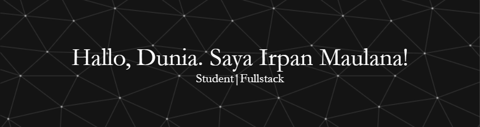

## Selamat datang 👋

- 🌱 I'm currently learning [**Laravel**](https://laravel.com) Framework

---

#### 🌐 Connect with me

---

#### 💻 Tech Stack:

---

### 📊 GitHub Stats:

 
 

---

#### 🔝 Top Contributed Repo

<h5 align="left">Play With Me</h5>

###

 

###
